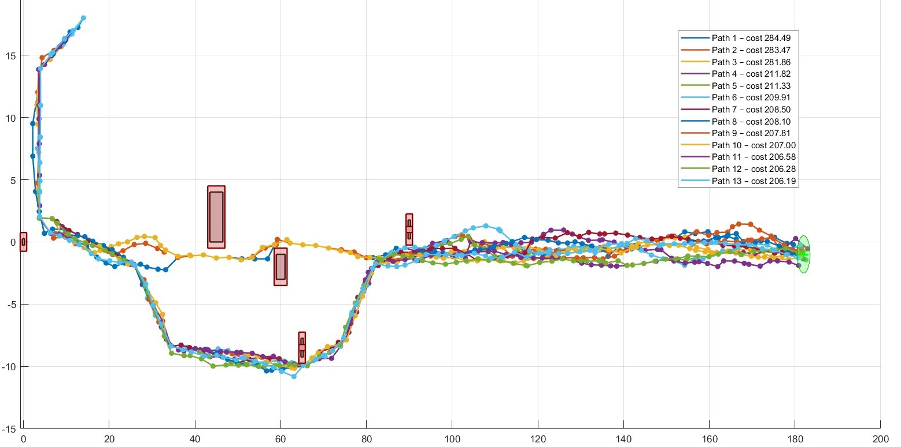
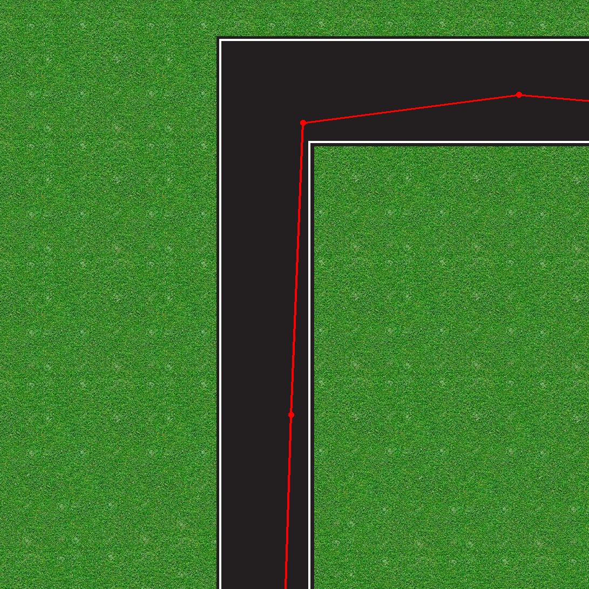
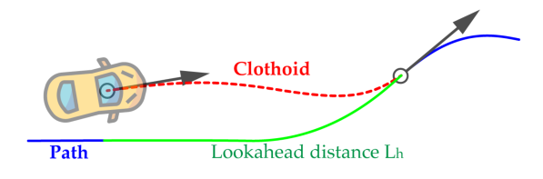
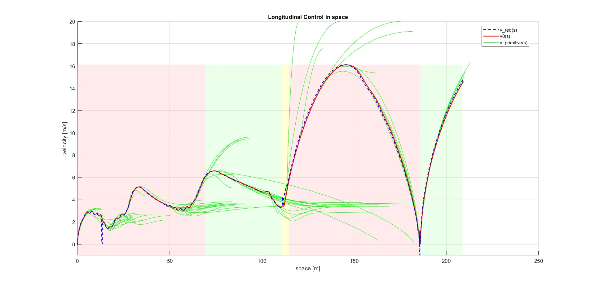

# Autonomous Driving Agent

## Overview
This project was developed for the course *Intelligent Vehicles and Autonomous Driving*, held by Prof. Gastone Pietro Rosati Papini at the University of Trento.
The goal is to develop an autonomous driving agent capable of handling complex scenarios. The system implements:
* Path finding using RRT*;
* Trajectory generation using clothoids;
* Clothoid-based lateral control;
* Longitudinal control with velocity profiling.

## How to compile
This project uses **Git Submodules** for the Clothoids library.

Clone the project:
```bash
git clone --recursive https://github.com/william-nicolussi/autonomous-driving-agent.git
```

Compile using CMake:
```bash
cd basic_agent
mkdir build
cd build
cmake ..
cmake --build .
```
To launch the program:
```bash
cd basic_agent/bin
./basic_agent
```
Run PyDrivingSim in another terminal:
```bash
cd PyDrivingSim
python simulator.py
```

## Scenarios
PyDrivingSim provides pre-defined simulation environments. Each scenario configures:
* The **starting position** of the vehicle;
* The **target destination**;
* The **traffic light** position;
* The placement of static **obstacles** (rocks and cones).

The road network consists of two terrain types: **asphalt** and **dirt**.
It is possible to modify the position of all objects in the scenario in `main_scenarios.py`.

### Configuration
It is possible to select the scenario by commenting/uncommenting the desired class within the `main()` function in `simulator.py`:

```python
# simulator.py
# Scenario1(av)
Scenario2(av)
```
### Scenario 1

This scenario is designed for path planning and trajectory tracking validation. It does not include a traffic light. 

### Scenario 2


This scenario features a traffic light and offers two possible routes to the target. It is designed to validate the RRT* cost function optimization: traveling on dirt roads has a higher cost than asphalt. The planner must identify the optimal path while minimizing the total cost.

## RRT* and Trajectory
In the first cycle within `starting_point.cc`, the algorithm searches for the optimal path using RRT* and generates a clothoid-based trajectory.

### rrt_star([...])
This function populates a vector representing the graph. Nodes are generated randomly within the road boundaries.

<p align="center">
  
   
</p>

Once the graph is built, it identifies the best solution.




### rrt_star_refine([...])
This function simplifies the graph by removing aligned nodes and merging them into single segments.

<p align="center">
   
  
</p>
<p align="center">
   
  
</p>

This refinement prevents clothoids from being squeezed into excessively short distances, ensuring smoother transitions.

### rrt_clothoid([...])
This function generates the actual trajectory using the Clothoids (G2Lib) library (https://github.com/ebertolazzi/Clothoids).


---

The folder `basic_agent/rrt` contains the source code for RRT* graph generation and clothoid transformation.

## Lateral Control
At each cycle in `starting_point.cc`, the algorithm identifies a lookahead point on the reference trajectory (at distance $L_{lookahead}=L_0+T_{look}\cdot u$) and calculates a clothoid $C1$ connecting the car's current position to the reference trajectory.



The steering angle is set using the formula:
$$\delta (s) = k(s) \cdot (L + K_{US} \cdot u^2)$$

## Longitudinal Control

The longitudinal control logic handles cruising speed, cornering safety, and traffic light interaction. The system operates in three main stages:

### Velocity Profiling
The agent scans the upcoming path (`SCAN_DIST` meters) to identify the maximum curvature $\kappa_{max}$ and computes a velocity limit to ensure safe lateral acceleration:
$$v_{limit} = \sqrt{\frac{a_{n,max}}{\kappa_{max}}}$$
The reference speed $v_r$ is the minimum between this limit and the user's cruising speed. It is further reduced if a significant lateral error is detected.

### Traffic Light Management 
The agent uses motion primitives to determine the longitudinal velocity profile. Based on the traffic light's state and distance, the system evaluates two main scenarios:

* **Pass**: Cross the intersection if the green/yellow time window allows it safely;

* **Stop**: Brake smoothly before the traffic light if the red phase is active or approaching.

 
 

The primitive generation code is located in the `basic_agent/matlab` folder.

### Actuation (PI Controller)
To track the required acceleration, a PI controller is implemented:
$$Pedal = K_p \cdot e(t) + K_i \cdot \int e(t) dt$$
Where $e(t) = a_{req} - a_{actual}$ is the error. The controller includes anti-windup logic to reset the integral term when the vehicle comes to a full stop.


## Author
William Nicolussi Zom